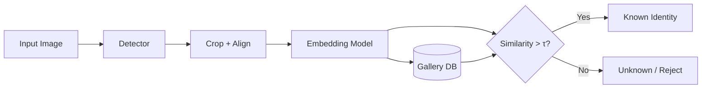

# Section 11.1: Detection vs Recognition

> **Source:** Prosise, Ch. 11 - face detection, recognition, verification, identification  
> **Prerequisites:** [Chapter 10 - CNNs](../chapter-10-convolutional-neural-networks/README.md) | [Section 5.7](../chapter-05-support-vector-machines/section-07-facial-recognition-with-svm-hog-and-olivetti-faces.md)  
> **Glossary:** [classification](../../GLOSSARY.md#classification) | [deep-learning](../../GLOSSARY.md#deep-learning) | [feature](../../GLOSSARY.md#feature)  
> **Math conventions:** [MATH_CONVENTIONS.md](../../MATH_CONVENTIONS.md)

---

## Two Different Problems

Face technology in Prosise Chapter 11 splits into two stages:

| Stage | Question | Output |
|-------|----------|--------|
| **Detection** | Where are faces in this image? | Bounding boxes |
| **Recognition** | Whose face is this? | Person ID or embedding match |

You cannot run recognition on a full group photo without detection first - the recognizer expects a **tightly cropped, aligned face**, not a 4000×3000 vacation panorama.

> **Humorous analogy:** Detection is finding Waldo in the crowd. Recognition is checking Waldo's passport after you've already pointed at him.

> **In plain English:** Detect faces → crop and align → extract identity features → compare to a gallery or reject unknown.

---

## Verification vs Identification

Within recognition, two operational modes matter:

| Mode | Also called | Question | Gallery size |
|------|-------------|----------|--------------|
| **Verification** | 1:1 matching | Is this person Alice? | One enrolled identity |
| **Identification** | 1:N search | Who is this person? | N enrolled identities |

**Verification** powers phone unlock: one template for you, compare probe to template, accept if similarity > threshold.

**Identification** powers airport watchlists: compare probe to thousands of enrolled embeddings, return best match if confident.

$$
\text{verification: } \quad s = \text{sim}(\mathbf{e}_{\text{probe}}, \mathbf{e}_{\text{claim}}) \stackrel{?}{>} \tau
$$

$$
\text{identification: } \quad \hat{i} = \arg\max_j \text{sim}(\mathbf{e}_{\text{probe}}, \mathbf{e}_j)
$$
> **Readable form:** verification = similarity between probe and claimed identity exceeds threshold; identification = pick gallery identity with highest similarity

---

## The Standard Pipeline

```
Full image
    ↓ Detection (Viola-Jones, MTCNN, RetinaFace)
Bounding boxes + landmarks (optional)
    ↓ Crop, resize, align
Face chip (e.g., 112×112 or 160×160)
    ↓ Embedding network (ArcFace, FaceNet)
L2-normalized vector (e.g., 512-D)
    ↓ Compare to gallery / threshold
Identity or "unknown"
```

[Section 11.2](./section-02-viola-jones-and-haar-cascades.md)-[11.3](./section-03-opencv-face-pipeline.md) cover detection and preprocessing. [Section 11.5](./section-05-face-embeddings-and-arcface.md)-[11.7](./section-07-open-set-classification.md) cover recognition and rejection.

---

## Closed-Set vs Open-Set

| Setting | Assumption | Risk |
|---------|------------|------|
| **Closed-set** | Probe always belongs to one of K training classes | Forces wrong ID on strangers |
| **Open-set** | Probe may be unknown | Requires threshold + reject class |

Prosise stresses **open-set** for security: a false accept (stranger unlocked as you) is worse than false reject (you retry). [Section 11.7](./section-07-open-set-classification.md) formalizes this.

[Chapter 09](../chapter-09-neural-networks/README.md) softmax on Olivetti was **closed-set** - 40 classes, every test face was one of them. Real deployments rarely have that guarantee.

---

## Comparison to Chapter 05 & 09

| Approach | Chapter | Input | Identity representation |
|----------|--------|-------|------------------------|
| HOG + SVM | 05 | Aligned 64×64 grayscale | Class label 0-39 |
| Flatten + Dense | 09 | Olivetti pixels | Softmax over 40 classes |
| ArcFace embeddings | 11 | Aligned RGB face chip | 512-D vector + distance |

Modern face systems use **metric learning** - same person → close vectors, different people → far apart - not raw softmax on pixels.

---

## Detection Metrics

| Metric | Meaning |
|--------|---------|
| **Detection rate** | Fraction of faces found |
| **False positives per image** | Non-faces flagged as faces |
| **IoU** | Overlap between predicted and true box |

Recognition metrics differ - [Section 11.6](./section-06-building-a-face-recognition-system.md) covers TAR/FAR.

---

## Bounding Box Anatomy

A detection returns $(x, y, w, h)$ in pixel coordinates:

- $(x, y)$ - top-left corner
- $w, h$ - width and height

Some APIs return center + size. Always verify coordinate format before cropping.

```python
# Crop face from image img (numpy array H×W×3)
x, y, w, h = box
face_crop = img[y:y+h, x:x+w]
```

Add margin padding for recognition - Prosise expands box 10-20% so hairline and chin aren't clipped.

---

## Landmarks and Alignment

Advanced detectors return **5 or 68 facial landmarks** (eyes, nose, mouth). **Alignment** rotates/scales the face so eyes sit at canonical positions - dramatically improves recognition accuracy.

```
Unaligned crop → embedding drift
Aligned 112×112 → consistent embedding geometry
```

[Section 11.3](./section-03-opencv-face-pipeline.md) implements basic resize; landmark alignment is optional upgrade with MTCNN or `face_alignment` library.

---

## System Architecture Diagram



---

## When to Combine Stages

| Scenario | Detector choice | Recognizer |
|----------|-----------------|------------|
| Real-time webcam | Haar or lightweight CNN | Mobile embedding model |
| Group photos | MTCNN / RetinaFace | ArcFace |
| Phone unlock | Specialized on-device | Quantized embedder |

Prosise teaches Haar → CNN detector → ArcFace so you understand the full stack.

---

## Privacy & Ethics Preview

Detection alone can count faces in a crowd without identifying anyone. **Recognition** links faces to identities - higher legal and ethical stakes. [Section 11.8](./section-08-ethics-and-deployment.md) covers consent and bias.

---

## Performance Budgeting

End-to-end latency is the sum of both stages:

| Stage | CPU (typical) | GPU (typical) |
|-------|---------------|---------------|
| Haar detection (720p) | 30-80 ms | N/A |
| MTCNN detection | 200-800 ms | 50-150 ms |
| ArcFace embedding | 50-150 ms | 10-30 ms |
| Gallery match (100 IDs) | <1 ms | <1 ms |

For 30 FPS video, total budget ≈ 33 ms - often requires lightweight detectors or skipping frames.

---

## Multi-Face Identification Logic

When a group photo yields three faces, run recognition **independently** per chip:

```python
import cv2

def identify_all_faces(detector_pipeline, recognizer, image_path):
    img, chips = detector_pipeline.process_image(image_path)
    results = []
    for i, item in enumerate(chips):
        name, sim = recognizer.identify(
            cv2.cvtColor(item['chip'], cv2.COLOR_RGB2BGR)
        )
        results.append({'face_id': i, 'box': item['box'],
                        'identity': name, 'similarity': sim})
    return results
```

Never assume one identity per image - family photos need per-box decisions.

---

## Rank-k Identification

For large galleries (10k+), brute-force linear scan may be slow. Approximate nearest neighbor (FAISS, Annoy) finds top-k matches:

$$
\text{top-k IDs} = \text{ANN}(\mathbf{e}_{\text{probe}}, \text{gallery}, k=5)
$$
> **Readable form:** top-k identities = approximate nearest neighbor search returning 5 closest embeddings

Prosise lab uses <20 identities - dot product against centroids is sufficient.

---

## Chapter Roadmap

| Section | You build |
|--------|-----------|
| 11.2-11.3 | Haar + OpenCV crop pipeline |
| 11.4 | MTCNN upgrade |
| 11.5-11.6 | ArcFace gallery + matcher |
| 11.7 | Threshold + open-set eval |
| 11.8 | Ethics checklist |
| Lab 11 | Full integrated demo |

---

## Self-Check

1. What is the difference between detection and recognition?
2. Verification vs identification - which is 1:N?
3. Why is closed-set accuracy misleading in production?
4. What does the embedding stage output?
5. Why align faces before recognition?

---

## References

- Prosise, *Applied ML and AI for Engineers*, Ch. 11 - detection vs recognition
- [Chapter 05 - Facial recognition SVM](../chapter-05-support-vector-machines/section-07-facial-recognition-with-svm-hog-and-olivetti-faces.md)
- [Chapter 10 - CNNs](../chapter-10-convolutional-neural-networks/README.md)
- [Face recognition survey (Wang & Deng)](https://arxiv.org/abs/1804.06655)
- [GLOSSARY.md](../../GLOSSARY.md) | [MATH_CONVENTIONS.md](../../MATH_CONVENTIONS.md)

---

**Previous:** [Chapter 10](../chapter-10-convolutional-neural-networks/README.md) | **Next:** [Section 11.2](./section-02-viola-jones-and-haar-cascades.md)


