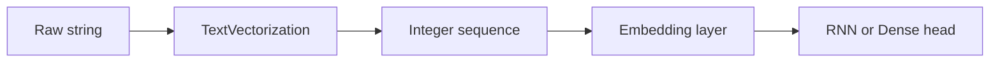

# Section 13.2: Text Preprocessing with Keras

> **Source:** Prosise, Ch. 13 - Tokenizer, pad_sequences, TextVectorization layer  
> **Prerequisites:** [Section 13.1](./section-01-beyond-bag-of-words.md) | [Chapter 04](../chapter-04-text-classification/section-02-text-preprocessing.md)  
> **Glossary:** [feature](../../GLOSSARY.md#feature) | [deep-learning](../../GLOSSARY.md#deep-learning)  
> **Math conventions:** [MATH_CONVENTIONS.md](../../MATH_CONVENTIONS.md)

---

## From CountVectorizer to Sequences

[Chapter 04](../chapter-04-text-classification/section-03-bag-of-words-and-tf-idf.md) used `CountVectorizer` → sparse word-count matrix. Neural NLP uses **integer sequences** - each sentence becomes a list of token indices into a vocabulary.

Prosise's Chapter 13 flow:

```
Raw text → lowercase / filter → tokenize → integer sequences → pad/truncate → model
```

> **Humorous analogy:** CountVectorizer is a census of word populations. Tokenizer is assigned seating - each word gets a seat number in a fixed-length row.

> **In plain English:** Convert sentences to same-length arrays of integers before feeding embedding layers.

---

## Keras Tokenizer (Classic API)

```python
from tensorflow.keras.preprocessing.text import Tokenizer
from tensorflow.keras.preprocessing.sequence import pad_sequences

lines = [
    'The quick brown fox',
    'Jumps over the lazy brown dog',
    'Who jumps high into the blue sky',
    'And quickly returns to earth',
]

tokenizer = Tokenizer()
tokenizer.fit_on_texts(lines)
sequences = tokenizer.texts_to_sequences(lines)
print(sequences)
print(f'Vocab size: {len(tokenizer.word_index)}')
```

`word_index` maps word → rank (1-based; 0 reserved for padding). OOV words are dropped unless you set `oov_token`.

---

## Padding & Truncation

RNNs and embedding layers need **fixed sequence length** $n$:

$$
\mathbf{s} = [t_1, t_2, \ldots, t_n] \quad \text{where } t_j \in \{0, \ldots, |V|-1\}
$$
> **Readable form:** each sentence becomes a length-n vector of token indices; 0 = padding token

```python
padded = pad_sequences(sequences, maxlen=6, padding='pre', truncating='pre')
print(padded)
```

| Parameter | Effect |
|-----------|--------|
| `maxlen` | Target length |
| `padding='pre'` | Pad at start (default) - common for classification |
| `padding='post'` | Pad at end - often better for translation |
| `truncating` | Which end to cut if too long |

---

## Stop Words & Custom Filters

Prosise notes: removing stop words **often doesn't help** classification. Custom `filters` remove digits:

```python
tokenizer = Tokenizer(
    filters='!"#$%&()*+,-./:;<=>?@[\$$^_`{|}~\t\n0123456789'
)
tokenizer.fit_on_texts(lines)
```

With NLTK stop-word removal (optional):

```python
import nltk
from nltk.corpus import stopwords
from nltk.tokenize import word_tokenize

nltk.download('stopwords', quiet=True)
nltk.download('punkt', quiet=True)

def clean(text):
    tokens = word_tokenize(text.lower())
    sw = set(stopwords.words('english'))
    return ' '.join(w for w in tokens if w.isalpha() and w not in sw)

cleaned = list(map(clean, lines))
```

---

## TextVectorization Layer (Modern Keras)

Embed preprocessing **inside the model** - training and inference share identical logic:

```python
import tensorflow as tf
from tensorflow.keras import layers

max_tokens = 10000
sequence_length = 100

vectorize = layers.TextVectorization(
    max_tokens=max_tokens,
    output_sequence_length=sequence_length,
    standardize='lower_and_strip_punctuation',
)

text_ds = tf.data.Dataset.from_tensor_slices(lines)
vectorize.adapt(text_ds)

sample = vectorize('The quick brown fox jumps')
print(sample.numpy())  # padded/truncated int sequence
```

**Benefits:**

- Saved with model (`model.save`)
- No manual `tokenizer.pkl` drift
- `output_mode='int'` for embeddings; `'tf_idf'` for baseline comparison

---

## OOV and Vocabulary Size

| Setting | Behavior |
|---------|----------|
| `max_tokens=10000` | Keep top 10k words by frequency |
| `oov_token='[UNK]'` | Unknown words map to special index |
| Rare words | Dropped or → OOV |

Vocabulary size $|V|$ controls embedding matrix rows - larger $|V|$ = more parameters:

$$
\text{embedding params} = |V| \times m
$$
> **Readable form:** embedding layer parameter count = vocabulary size times embedding dimension m

---

## Train/Test Consistency

**Critical rule:** fit `Tokenizer` or `adapt()` on **training text only**:

```python
vectorize = layers.TextVectorization(max_tokens=20000, output_sequence_length=200)
vectorize.adapt(train_texts)  # NOT full corpus including test

# Inference
vectorize(['new review text here'])
```

Leaking test vocabulary inflates metrics - same principle as [Chapter 04](../chapter-04-text-classification/section-08-pipelines-and-production-text-ml.md) sklearn pipelines.

---

## IMDB-Scale Example

```python
import tensorflow as tf

(train_text, train_labels), (test_text, test_labels) = tf.keras.datasets.imdb.load_data(
    num_words=10000
)
# Already integer-encoded by Keras; word_index in get_word_index()

print(train_text[0][:20])
print(f'Max sequence length in train: {max(len(x) for x in train_text)}')

from tensorflow.keras.preprocessing.sequence import pad_sequences
X_train = pad_sequences(train_text, maxlen=256, padding='pre')
X_test = pad_sequences(test_text, maxlen=256, padding='pre')
```

Prosise builds sentiment models on similar padded sequences in subsequent sections.

---

## Standardize Functions

`TextVectorization` `standardize` options:

| Value | Action |
|-------|--------|
| `lower_and_strip_punctuation` | Default-like |
| `lower` | Lowercase only |
| Custom callable | `lambda s: tf.strings.regex_replace(s, r'[^a-z ]', '')` |

Match Chapter 04 preprocessing choices when comparing baselines.

---

## Pipeline Diagram



---

## Debugging Tips

```python
# Inverse lookup
vocab = vectorize.get_vocabulary()
inv = {i: w for i, w in enumerate(vocab)}
decoded = [inv.get(i, '?') for i in sample.numpy() if i != 0]
print(' '.join(decoded))
```

Inspect padded sequences when model predicts all one class - often empty or all-OOV sequences.

---

## Self-Check

1. Why is index 0 reserved in padded sequences?
2. What is the difference between `padding='pre'` and `'post'`?
3. Why adapt TextVectorization on training data only?
4. How does Tokenizer differ from CountVectorizer output format?
5. What does `max_tokens` control in TextVectorization?

---

## References

- Prosise, *Applied ML and AI for Engineers*, Ch. 13 - text preparation
- [Keras TextVectorization](https://www.tensorflow.org/api_docs/python/tf/keras/layers/TextVectorization)
- [Chapter 04 - Text preprocessing](../chapter-04-text-classification/section-02-text-preprocessing.md)
- [GLOSSARY.md](../../GLOSSARY.md) | [MATH_CONVENTIONS.md](../../MATH_CONVENTIONS.md)

---

**Previous:** [Section 13.1](./section-01-beyond-bag-of-words.md) | **Next:** [Section 13.3](./section-03-embedding-layers.md)
