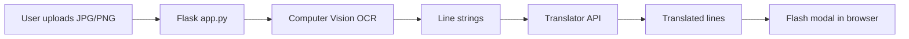

# Section 14.7: Contoso Travel - Multi-Service App

> **Source:** Prosise, Ch. 14 - "Putting It All Together: Contoso Travel"  
> **Prerequisites:** [Sections 14.3-14.6](./section-03-azure-computer-vision.md) | [Chapter 07](../chapter-07-operationalizing-models/README.md)  
> **Glossary:** [model](../../GLOSSARY.md#model) | [classification](../../GLOSSARY.md#classification) | [deep-learning](../../GLOSSARY.md#deep-learning)  
> **Math conventions:** [MATH_CONVENTIONS.md](../../MATH_CONVENTIONS.md)

---

## The Business Problem

Contoso Travel wants a website feature: travelers photograph foreign road signs and see translations - no typing, no forms. A few years ago this required a dedicated ML team. Today it is a **Flask app** chaining [Computer Vision](./section-03-azure-computer-vision.md) OCR with [Translator](./section-05-azure-translator.md).

> **Humorous analogy:** You are the travel agent who speaks zero languages but carries three interpreters in your pocket - Vision reads the sign, Translator explains it, Flask serves the coffee.

> **In plain English:** Upload photo → extract text lines → translate to selected language → display results.

Prosise's sample (Fig. 14-6) is intentionally minimal: one page, one upload flow, two cognitive services. That is the pattern for most enterprise AI features - orchestration, not model training.

---

## Architecture



| Component | Service | Responsibility |
|-----------|---------|----------------|
| Web tier | Flask | Upload handling, UI |
| OCR | Computer Vision | `recognize_printed_text_in_stream` |
| Translation | Translator | Batch `translate` REST call |
| Optional | Speech | Vocalize translated text |

**Latency budget:** OCR (~1-3 s) + translation (~0.5-1 s) + network. Show a spinner; users tolerate seconds for photo translation.

---

## Project Structure

Prosise's starter kit contains:

| File | Role |
|------|------|
| `app.py` | Routes, upload logic, service calls |
| `templates/index.xhtml` | Home page with upload + language dropdown |
| `static/main.css` | Styling |
| `static/banner.jpg` | Branding |
| `static/placeholder.jpg` | Empty-state image |

Run locally:

```bash
export FLASK_ENV=development   # auto-reload on file changes
flask run
# → http://localhost:5000
```

Configure credentials at top of `app.py`:

```python
vision_key = 'VISION_KEY'
vision_endpoint = 'VISION_ENDPOINT'
translator_key = 'TRANSLATOR_KEY'
translator_endpoint = 'TRANSLATOR_ENDPOINT'  # Text Translation endpoint
translator_region = 'TRANSLATOR_REGION'      # e.g. southcentralus
```

Never commit real keys - use environment variables in production ([Section 14.8](./section-08-production-considerations.md)).

---

## Step 1: Extract Text (Computer Vision)

```python
from azure.cognitiveservices.vision.computervision import ComputerVisionClient
from azure.cognitiveservices.vision.computervision.models import ComputerVisionErrorResponseException
from msrest.authentication import CognitiveServicesCredentials

def extract_text(endpoint, key, image_stream):
    try:
        client = ComputerVisionClient(endpoint, CognitiveServicesCredentials(key))
        result = client.recognize_printed_text_in_stream(image_stream)
        lines = []
        for region in result.regions:
            for line in region.lines:
                text = ' '.join(word.text for word in line.words)
                lines.append(text)
        if not lines:
            lines.append('Photo contains no text to translate')
        return lines
    except ComputerVisionErrorResponseException as e:
        return [f'Error calling Computer Vision: {e.message}']
    except Exception:
        return ['Error calling the Computer Vision service']
```

**Upgrade path:** Replace `recognize_printed_text_in_stream` with `read_in_stream` for handwritten or difficult signage - async polling pattern from [Section 14.3](./section-03-azure-computer-vision.md).

---

## Step 2: Translate Lines (Translator)

```python
import requests

def translate_text(endpoint, region, key, lines, language):
    try:
        headers = {
            'Ocp-Apim-Subscription-Key': key,
            'Ocp-Apim-Subscription-Region': region,
            'Content-type': 'application/json',
        }
        payload = [{'text': line} for line in lines]
        uri = endpoint + f'translate?api-version=3.0&to={language}'
        response = requests.post(uri, headers=headers, json=payload)
        response.raise_for_status()
        translated = []
        for result in response.json():
            for t in result['translations']:
                translated.append(t['text'])
        return translated
    except requests.exceptions.HTTPError as e:
        return [f'Error calling Translator: {e}']
    except Exception:
        return ['Error calling the Translator service']
```

Batch all lines in **one** HTTP request - cheaper and faster than per-line calls.

---

## Step 3: Wire Into Flask `index` Route

Inside the upload handler (Prosise's `index` function):

```python
# After user uploads image stream:
lines = extract_text(vision_endpoint, vision_key, image)
translated_lines = translate_text(
    translator_endpoint, translator_region, translator_key,
    lines, language)  # language from dropdown, e.g. 'en', 'de', 'ja'

for translated_line in translated_lines:
    flash(translated_line)  # Flask message flashing → modal dialog
```

User flow:
1. Select target language from dropdown
2. Click Upload Photo → choose JPG/PNG
3. Server OCRs image → translates each line → flashes results

---

## Error Handling Strategy

| Failure | User sees | Log |
|---------|-----------|-----|
| Image > 4 MB | Friendly resize hint | `ComputerVisionErrorResponseException` |
| No text detected | "Photo contains no text..." | OCR returned empty |
| Translator 429 | "Service busy, retry" | Rate limit + backoff |
| Invalid key | Generic error | 401 - alert ops |

```python
import logging
log = logging.getLogger('contoso')

def safe_pipeline(image, language):
    log.info('ocr_start')
    lines = extract_text(vision_endpoint, vision_key, image)
    log.info('ocr_lines=%d', len(lines))
    log.info('translate_start lang=%s', language)
    return translate_text(translator_endpoint, translator_region,
                          translator_key, lines, language)
```

Translate **error messages** too - Prosise suggests using Translator on user-facing error strings for localized UX.

---

## Extensions (Optional)

| Enhancement | Service | Effort |
|-------------|---------|--------|
| Read results aloud | Speech TTS ([Section 14.6](./section-06-azure-speech-services.md)) | Low |
| Detect sign language | Language `detect_language` | Low |
| Summarize long signs | Language key phrases | Medium |
| Voice input instead of photo | Speech STT | Medium |

Hybrid architecture from [Section 14.1](./section-01-build-vs-buy-in-ai.md): APIs for commodity OCR/NMT; custom model only if signage domain is highly specialized.

---

## Decision Matrix: API vs Custom

| Criterion | Contoso (APIs) | Custom Chapter 13 NMT |
|-----------|----------------|---------------------|
| Time to ship | Hours | Weeks |
| Handwriting | `read_in_stream` helps | Retrain |
| Privacy | Data leaves tenant | On-prem possible |
| Cost at scale | Per-character billing | GPU hosting |
| Quality | Production NMT | Limited training data |

Document this matrix in [Lab 14](./section-lab-14-contoso-travel-assistant.md) deliverable.

---

## Testing Checklist

1. Upload printed road sign (French → English)
2. Upload image with no text - verify graceful message
3. Upload oversized image - verify error handling
4. Wrong Translator region - verify 401 caught
5. Refresh page - translated lines appear in modal

---

## Common Mistakes

| Mistake | Symptom | Fix |
|---------|---------|-----|
| Wrong Translator endpoint | 404 on translate | Use "Text Translation" endpoint |
| Missing region header | 401 Unauthorized | Set `Ocp-Apim-Subscription-Region` |
| One API call per line | High latency + cost | Batch lines in single POST |
| Keys in source control | Security incident | Environment variables / Key Vault |
| No loading indicator | Users double-upload | Disable button during processing |

---

## Self-Check

1. Which two Cognitive Services does the minimal Contoso app use?
2. Why batch translation lines in one request?
3. What Flask feature displays translated text to the user?
4. When would you switch from `recognize_printed_text_in_stream` to `read_in_stream`?
5. How would you add spoken output without changing the OCR pipeline?

---

## Exercises

1. Add a language dropdown with 5 target languages and verify translations.
2. Implement exponential backoff on Translator 429 responses.
3. Draw an architecture diagram including optional Speech service.
4. Estimate monthly API cost for 10,000 photo uploads averaging 3 lines each.

---

## References

- Prosise, *Applied ML and AI for Engineers*, Ch. 14 - Contoso Travel
- [Flask message flashing](https://flask.palletsprojects.com/en/latest/patterns/flashing/)
- [Computer Vision OCR](https://learn.microsoft.com/en-us/azure/ai-services/computer-vision/overview-ocr)
- [Translator REST API](https://learn.microsoft.com/en-us/azure/ai-services/translator/reference/v3-0-translate)
- [GLOSSARY.md](../../GLOSSARY.md) - [model](../../GLOSSARY.md#model), [deep-learning](../../GLOSSARY.md#deep-learning)
- [MATH_CONVENTIONS.md](../../MATH_CONVENTIONS.md)

---

**Previous:** [Section 14.6 - Azure Speech Services](./section-06-azure-speech-services.md)  
**Next:** [Section 14.8 - Production Considerations](./section-08-production-considerations.md)