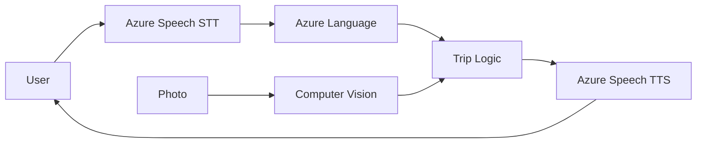

# Lab 14: Contoso Travel Assistant

> **Prerequisites:** Sections [14.1](./section-01-build-vs-buy-in-ai.md)-[14.8](./section-08-production-considerations.md)  
> **Estimated time:** 4-6 hours  
> **Glossary:** [../../GLOSSARY.md](../../GLOSSARY.md) | **Math:** [MATH_CONVENTIONS.md](../../MATH_CONVENTIONS.md)

---

## Objectives

By the end of this lab you will:

1. Build a **Contoso Travel assistant** combining Speech, Language, Translator, and Computer Vision
2. Support **voice input**, **text input**, and **photo upload** paths
3. **Log services called** per request with latency
4. Handle API errors with **retries and fallbacks**
5. Deliver an **architecture diagram** and **build-vs-buy decision matrix**

> **Humorous briefing:** You are the architect. Contoso is the client. Azure is the subcontractor. Do not let the subcontractor go offline without a backup plan.

---

## Setup

```python
# pip install azure-cognitiveservices-speech azure-ai-textanalytics
# pip install azure-ai-vision-imageanalysis requests python-dotenv
import os, time, logging, uuid
from pathlib import Path
from dotenv import load_dotenv

load_dotenv()
logging.basicConfig(level=logging.INFO)
logger = logging.getLogger("contoso-lab")

OUT_DIR = Path('lab14_output'); OUT_DIR.mkdir(exist_ok=True)
```

Configure `.env` with keys from [Section 14.2](./section-02-azure-setup-and-authentication.md):

```
AZURE_SPEECH_KEY=...
AZURE_SPEECH_REGION=eastus
AZURE_LANGUAGE_ENDPOINT=...
AZURE_LANGUAGE_KEY=...
AZURE_CV_ENDPOINT=...
AZURE_CV_KEY=...
AZURE_TRANSLATOR_KEY=...
AZURE_TRANSLATOR_REGION=eastus
```

---

## Part A: Service Clients (45 min)

Implement factory functions returning configured clients - see Sections [14.3-14.6](./section-03-azure-computer-vision.md).

```python
def build_assistant():
    """Return ContosoTravelAssistant with all clients wired."""
    # speech_stt, speech_tts, language_client, translator, vision_client
    ...
    return ContosoTravelAssistant(...)
```

**Verify:** Run analyze_sentiment on `"I love Paris"` → positive.

---

## Part B: Core Pipeline (90 min)

Implement `ContosoTravelAssistant` from [Section 14.7](./section-07-contoso-travel-multi-service-app.md):

### B1. TravelContext dataclass
Track transcript, destinations, dates, sentiment, photo_tags, ocr_text, services_called, latencies.

### B2. Text query path

```python
def handle_text(self, text: str) -> dict:
    ctx = TravelContext(transcript=text)
    t0 = time.perf_counter()
    self._analyze_language(ctx)
    response = self._generate_response(ctx)
    ctx.latency_ms['total'] = (time.perf_counter() - t0) * 1000
    return {'response': response, 'context': ctx}
```

Test: `"I want to visit Tokyo in March"` → Location=Tokyo, DateTime=March.

### B3. Photo path

```python
def handle_photo(self, image_path: str, question: str = "") -> dict:
    ...
```

Upload sample travel photo; verify tags + optional OCR translation.

### B4. Voice path (optional)

Requires microphone - or use pre-recorded `.wav`:

```python
def handle_voice(self) -> dict:
    ...
```

Skip if no mic; document in README.

---

## Part C: Error Handling (45 min)

Implement from [Section 14.8](./section-08-production-considerations.md):

```python
def call_with_retry(fn, service_name, ctx, max_retries=3):
    for attempt in range(max_retries):
        try:
            t0 = time.perf_counter()
            result = fn()
            ctx.latency_ms[service_name] = (time.perf_counter() - t0) * 1000
            ctx.services_called.append(service_name)
            return result
        except Exception as e:
            logger.warning("%s attempt %d failed: %s", service_name, attempt+1, e)
            if attempt == max_retries - 1:
                return None
            time.sleep(2 ** attempt)
```

**Test:** Temporarily set invalid Language key → verify fallback response still returns.

---

## Part D: CLI Application (60 min)

```python
def main():
    assistant = build_assistant()
    print("Contoso Travel Lab")
    print("Commands: text <msg> | photo <path> | voice | quit")
    
    while True:
        cmd = input("> ").strip()
        if cmd.startswith("text "):
            result = assistant.handle_text(cmd[5:])
            print("Response:", result['response'])
            print("Services:", result['context'].services_called)
        elif cmd.startswith("photo "):
            result = assistant.handle_photo(cmd[6:])
            print(result['response'])
        elif cmd == "voice":
            result = assistant.handle_voice()
            print(result['response'])
        elif cmd == "quit":
            break

if __name__ == "__main__":
    main()
```

Log each session to `lab14_output/session_log.jsonl`.

---

## Part E: Architecture Diagram (30 min)

Create diagram (Mermaid, draw.io, or ASCII) showing:

- User inputs (voice, text, photo)
- Each Azure service
- Your orchestration code
- Error fallback paths

Example Mermaid skeleton:



---

## Part F: Build vs Buy Matrix (45 min)

| Capability | Azure API used | Course 1 custom alternative | Replace when? |
|------------|----------------|----------------------------|---------------|
| Speech-to-text | Azure Speech | - (Whisper, Course 3) | |
| Sentiment | Azure Language | Chapter 04/13 BERT | |
| NER | Azure Language | Custom NER model | |
| Translation | Azure Translator | Section 13.5 seq2seq | |
| Image tags/OCR | Computer Vision | Chapter 10 CNN | |
| Object detection | - | Chapter 12 YOLO/Custom Vision | |

Fill **Replace when?** column with 1-2 sentences per row - this is a primary deliverable.

---

## Deliverables Checklist

- [ ] Working CLI (`contoso_travel.py` or notebook)
- [ ] `session_log.jsonl` with services_called per request
- [ ] Architecture diagram in `lab14_output/`
- [ ] Build-vs-buy matrix (Part F)
- [ ] Keys via `.env` only - not in submitted code

---

## Sample Test Scenarios

| Input | Expected behavior |
|-------|-------------------|
| `"Flights to Paris were delayed, very frustrated"` | negative sentiment; Paris NER |
| Photo of landmark | tags/caption mention architecture |
| French text (if Translator wired) | translated; NER on English |
| Invalid API key | graceful fallback message |

---

## Troubleshooting

| Issue | Fix |
|-------|-----|
| 401 Unauthorized | Check region headers (Translator!) |
| 429 Too Many Requests | Backoff; wait between tests |
| Empty NER | Short text; try longer sentence with city name |
| TTS silent | Check audio output device; save to WAV file |

---

## References

- Prosise, Ch. 14 - Contoso Travel lab
- [Section 14.7 - Architecture](./section-07-contoso-travel-multi-service-app.md)
- [Course Capstone](../../projects/capstone/README.md)

---

**Congratulations!** You have completed **Course 1: Applied Machine Learning & AI for Engineers**.